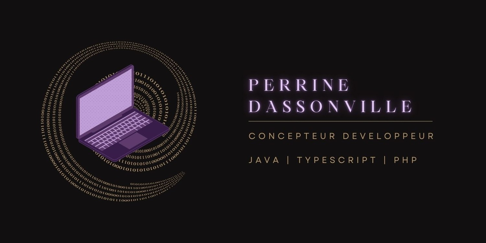

<!--
**Xenophee/Xenophee** is a ✨ _special_ ✨ repository because its `README.md` (this file) appears on your GitHub profile.

Here are some ideas to get you started:

- 🔭 I’m currently working on ...
- 🌱 I’m currently learning ...
- 👯 I’m looking to collaborate on ...
- 🤔 I’m looking for help with ...
- 💬 Ask me about ...
- 📫 How to reach me: ...
- 😄 Pronouns: ...
- ⚡ Fun fact: ...
-->

      <h1>
            
      </h1>

    

 

    
N'hésitez pas à consulter mon portfolio :

    

 

<h2 align="center">Projets en cours</h2>

 

 

 

<h2 align="center">Compétences</h2>
 

      <table>
            <thead>
                  <tr>
                        <th></th>
                        <th></th>
                  </tr>
            </thead>
            <tbody>
                  <tr>
                    <td><strong>Langages</strong></td>
                    <td>
                      
                      
                      
                      
                      
                    </td>
                  </tr>
                  <tr>
                    <td><strong>Frameworks</strong></td>
                    <td>
                      
                      
                        
                    </td>
                  </tr>
                    <tr>
                    <td><strong>BDD</strong></td>
                    <td>
                        
                        
                        
                    </td>
                  </tr>
                    <tr>
                    <td><strong>DevOps</strong></td>
                    <td>
                        
                        
                    </td>
                  </tr>
                  <tr>
                    <td><strong>Outils</strong></td>
                    <td>
                      
                      
                        
                        
                    </td>
                  </tr>
            </tbody>
      </table>

 
 

<h2 align="center">Objectifs 2025-2026</h2>
 

  

 
 

<h2 align="center">Statistiques</h2>
 

      
      

 

 
      

 
 

<h2 align="center">Contact</h2>
 

    

